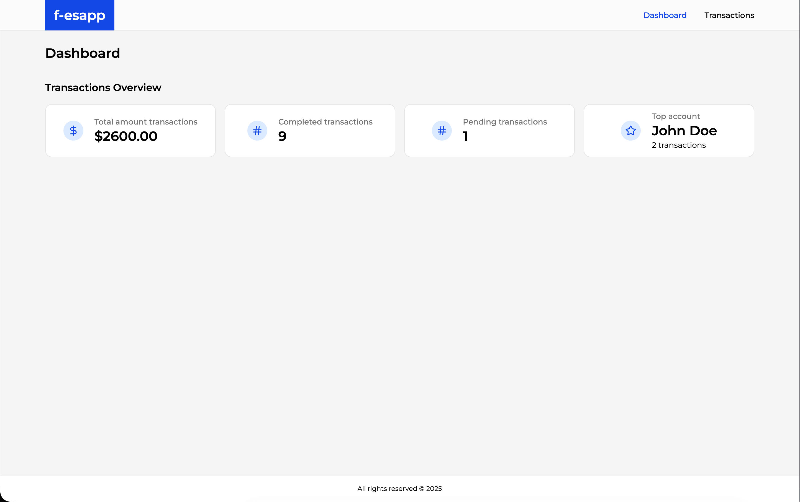
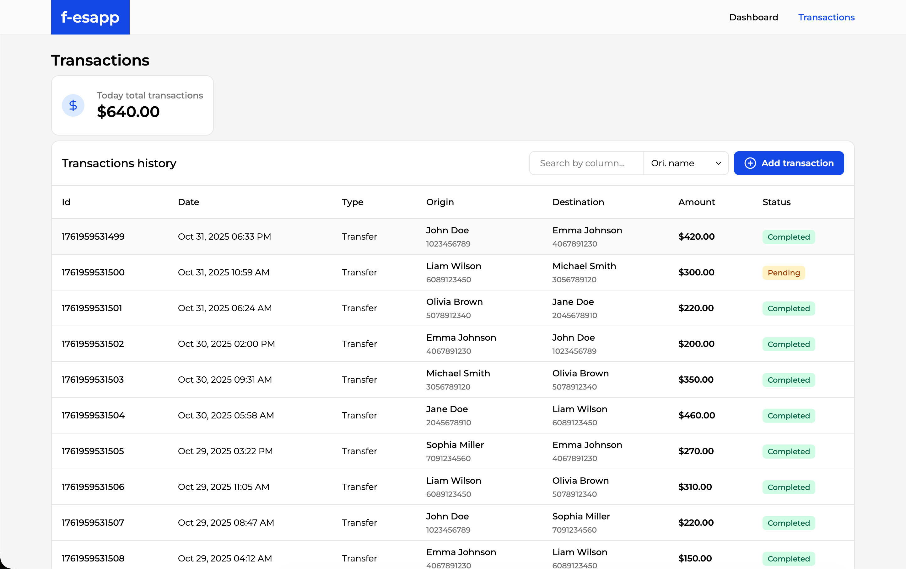

# Transaction Simulator App

[](https://opensource.org/licenses/MIT)

[](https://vitejs.dev/)
[](https://react.dev/)
[](https://www.typescriptlang.org/)
[](https://tailwindcss.com/)
[](https://react-hook-form.com/)
[](https://reactrouter.com/)
[](https://tanstack.com/query/v5)
[](https://zod.dev/)

## Overview

This is a transaction simulator application built with a modern frontend stack including React, TypeScript, and Vite. It provides a user-friendly interface to simulate financial transactions between different accounts, view a dashboard with the latest transaction history, and monitor account balances. The UI was based on the dribbble design: https://dribbble.com/shots/24557172-Admin-Transaction-Ui

## ✨ Features

- **Transaction Simulation**: Easily create and manage simulated transactions.
- **Dashboard**: View a summary of recent transactions and account balances at a glance.
- **Account Management**: Keep track of multiple accounts and their balances.
- **Responsive Design**: A clean and responsive UI built with Tailwind CSS.

## 📦 Tech Stack

- **Framework**: React 18
- **Language**: TypeScript
- **Build Tool**: Vite
- **Styling**: Tailwind CSS
- **Form Management**: React Hook Form
- **Routing**: React Router
- **Data Fetching**: React Query
- **Schema Validation**: Zod
- **Linting**: ESLint
- **Formatting**: Prettier

## 🚀 Getting Started

### Prerequisites

- [Node.js](https://nodejs.org/) `v18` or later
- [pnpm](https://pnpm.io/) (optional, but recommended)

### Installation

1.  **Clone the repository:**

    ```bash
    git clone https://github.com/alexsantosquispe/fake-esapp.git
    cd fake-esapp
    ```

2.  **Install dependencies:**

    ```bash
    npm install
    # or
    pnpm install
    ```

3.  **Start the development server:**

    ```bash
    npm run dev
    # or
    pnpm dev
    ```

4.  **Open the app:**

    Visit `http://localhost:5173` to view the app.

## 🖼️ Screenshots

<div align="center">
  
  
</div>

## 📜 Available Scripts

In the project directory, you can run the following commands:

- `npm run dev`: Runs the app in development mode.
- `npm run build`: Builds the app for production.
- `npm run preview`: Serves the production build locally.
- `npm run lint`: Lints the project files.
- `npm run format:check`: Checks the formatting of project files.
- `npm run format:fix`: Formats the project files.

## 📂 Folder Structure

```
src/
├── App.tsx
├── AppRouter.tsx
├── components/
│   ├── atoms/
│   └── molecules/
├── context/
├── hooks/
├── icons/
├── pages/
├── store/
├── types.ts
└── utils/
```

- `src/components`: Contains reusable UI components, organized into `atoms` and `molecules` based on Atomic Design principles.
- `src/context`: Holds React context providers for state management.
- `src/hooks`: Custom React hooks for reusable logic.
- `src/icons`: SVG icons used throughout the application.
- `src/pages`: Top-level page components that correspond to different routes.
- `src/store`: State management logic (e.g., Zustand or Redux).
- `src/types.ts`: TypeScript type definitions.
- `src/utils`: Utility functions.

## 💡 Best Practices

- **TypeScript for Type Safety**: The entire codebase is written in TypeScript to ensure type safety and improve developer experience.
- **Atomic Design**: Components are organized following Atomic Design principles (`atoms`, `molecules`) to promote reusability and scalability.
- **Custom Hooks**: Reusable logic is extracted into custom hooks to keep components clean and maintainable.
- **Code Quality**: ESLint and Prettier are configured to enforce a consistent code style and catch potential errors early.
